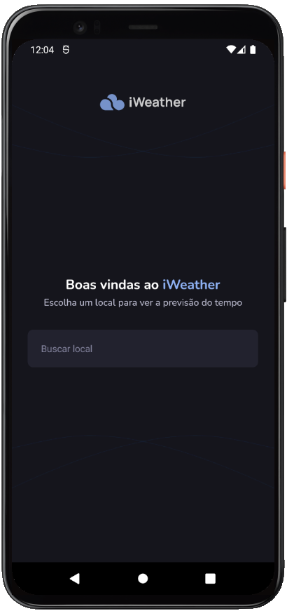
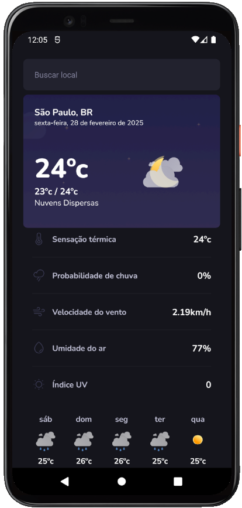

# iWeather

<p align="center">
  
  
</p>

<br>

## 💻 Projeto

**[iWeather](https://github.com/AdrianoTobias/iweather)**, é uma aplicação mobile com o framework Expo, voltada a clima, utilizada para o aprendizado de build Android e iOS.

O projeto também possui cobertura de testes e continuous integration (CI).

É uma aplicação desenvolvida durante o **[MBA Fullstack](https://www.rocketseat.com.br/mba)**, provido pela **[Rocketseat](https://rocketseat.com.br/)**, em parceria com a **[Sirius Education](https://landing.sirius.education/home/)**.


## 🧪 Tecnologias

Esse projeto foi desenvolvido com as seguintes tecnologias:

- [React Native](https://reactnative.dev/)
- [Expo](https://expo.dev/)
- [TypeScript](https://www.typescriptlang.org/)
- [Jest](https://jestjs.io/pt-BR/docs/getting-started)


## 🚀 Como executar

Clonar o projeto e acessar a pasta do mesmo:

```bash
$ git clone https://github.com/AdrianoTobias/iweather.git
$ cd iweather
```

Para iniciá-lo:
```bash
# Instalar as dependências
$ npm install
```

```bash
# Iniciar a aplicação
$ npx expo start
```
A aplicação poderá ser acessada via dispositivo (físico ou emulador), através do [Expo Go](https://docs.expo.dev/get-started/set-up-your-environment/).

Para executar os testes:
```bash
# Iniciar os testes
$ npm run test
```


[Adriano Tobias](https://github.com/AdrianoTobias)